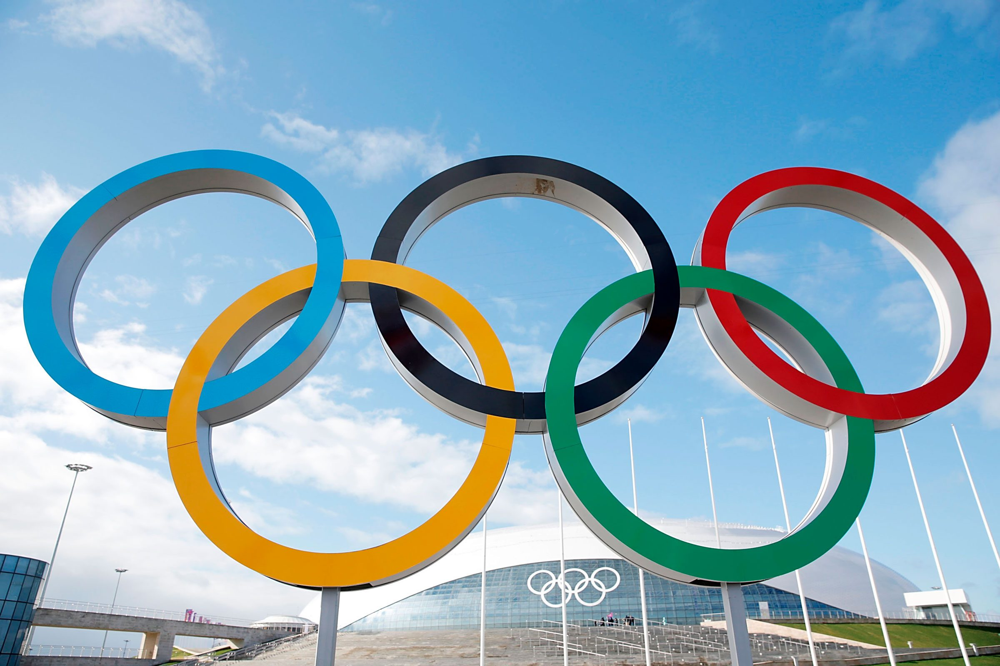

```{r setup, include = FALSE}
# Set code chunk defaults 
# Consider adding `message = FALSE` option
knitr::opts_chunk$set(echo = FALSE) 
                      
# Set R environment options
options(knitr.kable.NA = '')

# Load packages
library(tidyverse)
library(dygraphs)
library(ggplot2)
library(DT)
library(ggthemes)
library(plotly)
library(viridis)
library(mosaic)

```

```{r}
#Import data
all_medals <- readRDS("ALL_medals.rds") 
map_data_gdp <- readRDS("map_data_gdp.rds")
map_data_gdp2 <- readRDS("map_data_gdp2.rds")
map_data_gdp3 <- readRDS("map_data_gdp3.rds")
gdp_pop_2016 <- readRDS("2016_gdp_pop.rds")
athletes_medals <- readRDS("athletes_medals.rds")

table_info <- gdp_pop_2016%>%
  select(Country, Total, gdp, Population)

```


```{r, fig.cap='Olympic Rings', out.width="80%", fig.align="center"}

```

# Intro

The Olympics are a worldwide celebration of the best athletes in the world that promotes peace and unity. There are no honors greater for athletes than winning a gold medal for their country. This incredible achievement may be influenced by obvious variables such as physical traits of the athletes, the type of olympics (summer or winter), or variables that one would not think are immediately related to sports. We suspect that factors such as a country's total GDP and Population. We explore if these factors influence the number of medals won in the Olympics in this blog. Our aim is to deepen our understanding of what factors influence a country's success in the games and spread the information in hopes that there may be a solution to even the playing field.


## USA Medal Exploration

```{r}
#usa medal time graph

dygraph(all_medals, main = "USA Medals ") %>%
  dySeries("Gold", label = "Gold", color = "gold") %>%
  dySeries("Silver", label = "Silver", color = "grey") %>%
  dySeries("Bronze", label = "Bronze", color = "brown") %>%
  dyRangeSelector(height = 20)

```

The above medal time graph demonstrates the number of medals that the United States won each year that the Olympics were held. This allows us to see how the United States has performed at the Olympic stage. The graph has very sharp curves up and down which represent the medal differences between the summer and winter olympics. The USA tends to win more medals in the summer Olympics than the Winter olympics.

## 2016 Olympic Data Analysis

```{r}
#2016 olympics example

p <- gdp_pop_2016 %>%
  ggplot(aes(x = gdp, y = Total, size = Population, text = Country )) +
  geom_point()+
  labs(
      title = "2016 Olympics Data",
      subtitle = "GDP, Population, Total Medals",
      y = "Total Medals at 2016 Games",
      x = "GDP")

ggplotly(p)

datatable(table_info, colnames = c('Country Name', 'Medal Count', 'GDP', 'Population'))

```

The above graph shows the relationship between a Country's GDP and the number of medals that they won at the 2016 Olympic games. There is a large cluster of countrys with low GDP and low medal count, as there are a lot of small countries that are not large medal winners. This graph shows that only two countries, namely the United States and China, are above the 50 medal count threshold. Consequently, those two countries have much greater GDP in comparison to other countries. The size of the points is related to that countries relative population. We can see that population is not as predictive of medal count as GDP is. This is because there are large and small points at both directions of the y axis (medal count). 


## GDP and Population Country Maps (2010)

```{r}
#GDP map 2010
mapplot<- ggplot(map_data_gdp, aes(x = long, y = lat, group = group, fill = gdp, text = region)) +
  geom_polygon(color = "black") +
  scale_fill_viridis(option = "magma", direction = -1) + 
  ggtitle("GDP by Country in 2010") +
  theme_void()

ggplotly(mapplot)

```

This map displays Total GDP in 2010 for countries around the world. Lighter shades indicate a lower total GDP, while darker shades represent a higher GDP. Countries such as China, The United States of America, and Japan are among the countries with the highest Total GDP. Users can hover over the country of their choice to identify the country's name and its Total GDP.

```{r}
#Population Map 2010
mapplot2 <- ggplot(map_data_gdp, aes(x = long, y = lat, group = group, fill = Count, text = region)) +
  geom_polygon(color = "black") +
  scale_fill_viridis(option = "mako", direction = -1) + 
  ggtitle("Country Populations in 2010") +
  theme_void()

ggplotly(mapplot2)

```

This map displays populations for countries around the world in 2010. Lighter shades indicate a relatively low population, while dark shades indicate a relatively high population. China and India are among the countries with the highest total population by a considerable margin. Users can hover over the country of their choice to identify the country's name and its population.

## Population and Medals won in 2016 Olympics

```{r}
#Medals won in 2016 Olympics vs Population
mapplot5 <- ggplot(map_data_gdp3, aes(x = long, y = lat, group = group, fill = MedalsVsPopulation, text = region)) +
  geom_polygon(color = "black") +
  scale_fill_viridis(option = "magma", direction = -1) + 
  ggtitle("Medals Vs. Population in 2016") +
  theme_void()

ggplotly(mapplot5)
```

This map displays the medals won in the 2016 Olympics versus the population of countries around the world in 2016. Lighter shades indicate a relatively low number of medals when compared to the population, while dark shades indicate a high number of medals when compared to the population. Grey represents the countries who did not win medals during the 2016 Olympics. Georgia, Azerbaijan, and Denmark are among the countries with the highest number of medals in context of their populations. Countries with high GDPs or populations such as the United States, China, Japan, and Brazil all won medals during the Olympics. Users can hover over the countries to view the country's name and Medals won in comparison to their population. The maps were created using ggplot in R.


## Athlete Medal Analysis 

```{r}
ggplot(athletes_medals, aes(x = cluster, fill = Medal)) +
  labs(title="K-means Clustering for Athletes", x="Cluster", y="Count")+
  scale_fill_manual(values=c("gold3", "gray88", "burlywood4")) +
  geom_bar()

```
  
## Height   
```{r}  
mosaic::favstats(Height ~ cluster, data = athletes_medals)
```

## Weight 
```{r}  
mosaic::favstats(Weight ~ cluster, data = athletes_medals)
```

This bar graph pulls from a dataset containing every Olympic medal winner in the competition's history(since data collection began). As you can see, the data is clustered. I clustered the data by height and weight, and measured the total medal count for each cluster, separated by the type of medal. 

The goal here is to observe how height and weight may hold an impact on whether or not an athlete will be successful in the olympics. Evidently, the 1st and 3rd clusters observed the most medaling. From this, we can conclude that the highest third of athletes by height and weight are more likely to medal than other shorter and lighter athletes. In a similar vein, the lowest third of athletes by height and weight are more likely to medal than the middle third. 

Similarly, we can observe individual types of medals across these three clusters. The same trend I described before is generally true for each type of medal, with the heaviest and tallest athletes winning the most gold, silver, and bronze medals. Though, the difference between the first two clusters is much less major. 


## Conclusion

Evidently, we have chosen a quite broad discussion topic. While we are interested in looking at country specific trends relating to the olympics, such as our first graph where we observe medal count for just the United States, we are also dive into quite universal trends amongst athletes throughout the world, such as our graphs on GDP and height and weight. We 


## References

<!-- Tidyverse Package -->  
Wickham H, Averick M, Bryan J, Chang W, McGowan LD, François R, Grolemund G, Hayes A, Henry L, Hester J, Kuhn
  M, Pedersen TL, Miller E, Bache SM, Müller K, Ooms J, Robinson D, Seidel DP, Spinu V, Takahashi K, Vaughan D,
  Wilke C, Woo K, Yutani H (2019). “Welcome to the tidyverse.” _Journal of Open Source Software_, *4*(43), 1686.
  doi:10.21105/joss.01686 <https://doi.org/10.21105/joss.01686>.
  
<!-- Dygraphs Package -->    
Vanderkam D, Allaire J, Owen J, Gromer D, Thieurmel B (2018). _dygraphs: Interface to 'Dygraphs' Interactive
  Time Series Charting Library_. R package version 1.1.1.6, <https://CRAN.R-project.org/package=dygraphs>.
 
<!-- Ggplot2 Package -->    
 H. Wickham. ggplot2: Elegant Graphics for Data Analysis. Springer-Verlag New York, 2016.

<!--DT Package -->
Xie Y, Cheng J, Tan X (2023). _DT: A Wrapper of the JavaScript Library 'DataTables'_. R package version 0.27,
  <https://CRAN.R-project.org/package=DT>.
  
<!--Ggthemes Package -->
Arnold J (2021). _ggthemes: Extra Themes, Scales and Geoms for 'ggplot2'_. R package version 4.2.4,
  <https://CRAN.R-project.org/package=ggthemes>.

<!-- Plotly Package -->    
C. Sievert. Interactive Web-Based Data Visualization with R, plotly, and shiny. Chapman and Hall/CRC Florida,
  2020.
  
<!-- Viridis Package -->  
Simon Garnier, Noam Ross, Robert Rudis, Antônio P. Camargo, Marco Sciaini, and Cédric Scherer (2021). Rvision -
  Colorblind-Friendly Color Maps for R. R package version 0.6.2.
  
<!-- Mosaic Package -->  
R. Pruim, D. T. Kaplan and N. J. Horton. The mosaic Package: Helping Students to 'Think with Data' Using R
  (2017). The R Journal, 9(1):77-102.

<!--  Athlete Dataset -->  
Heesoo, K. (2017), "120 years of Olympic history: athletes and results" (Version 2), *Kaggle*, available at <https://www.kaggle.com/heesoo37/120-years-of-olympic-history-athletes-and-results>.

<!--  Population Dataset -->   
Devakumar, K. P. (2021), "World population 1960-2018" (Version 6), *Kaggle*, available at  <https://www.kaggle.com/imdevskp/world-population-19602018>.

<!--  GDP Dataset --> 
Loong, Ho. (2021), "GDP of each country and region(1960-2020)" (Version 3), *Kaggle*, available at  <https://www.kaggle.com/holoong9291/gdp-of-all-countries19602020>.

